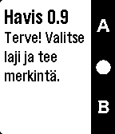

## havis-pebble

Document birdwathing observations using your watch! 

    

- https://pebble.github.io/pebblejs/
- https://developer.pebble.com/

#### Installation
 export PEBBLE_PHONE=ip_of_the_phone
 
 pebble build && pebble install

#### Related links:
- http://www.birdlife.fi/ohjeet/tiira_ohje_fi.pdf
- https://dev.w3.org/geo/api/spec-source.html
- http://www.sitepoint.com/understanding-module-exports-exports-node-js/
- https://spring.io/understanding/javascript-modules
- https://developer.mozilla.org/en/docs/web/javascript/reference/statements/export (ES6)

